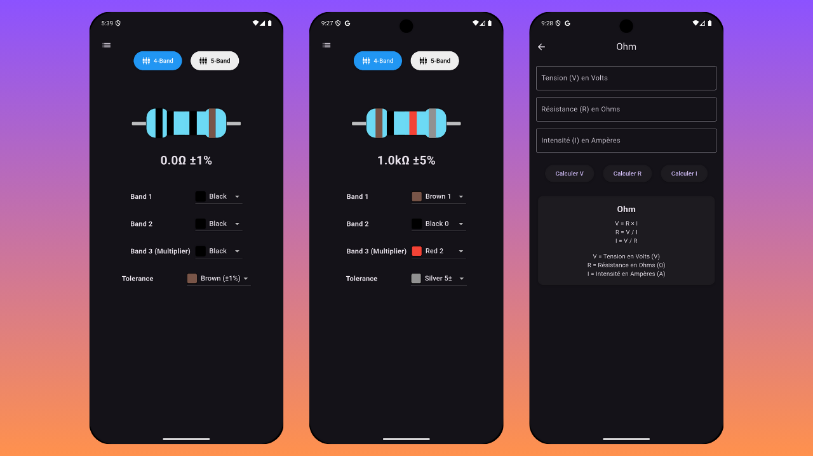
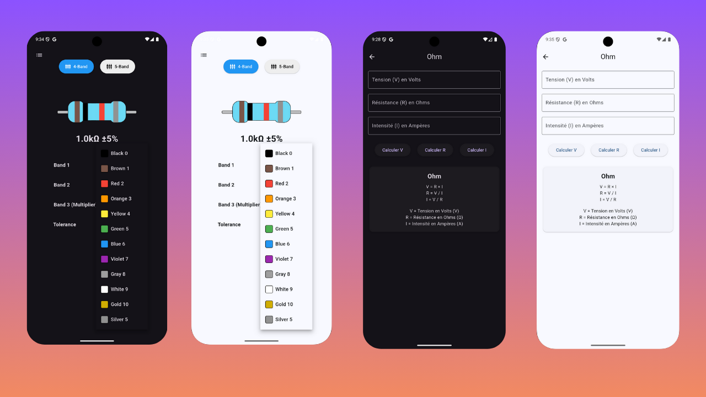

# Ohm Color

A Flutter application for color-based calculations using Ohm's law and resistor color codes.

## Features

- Calculate resistance values using color bands
- Convert between color codes and resistance values
- User-friendly interface for electronics enthusiasts
- Cross-platform support (iOS, Android, Web)

## Image 

<!-- ![icon]{assets/icon/icon.png} -->






## Installation

1. Make sure you have Flutter installed on your machine
2. Clone this repository:
   ```bash
   git clone https://github.com/abod8639/Ohm_Color.git
   ```
3. Navigate to the project directory:
   ```bash
   cd ohm_color
   ```
4. Install dependencies:
   ```bash
   flutter pub get
   ```
5. Run the app:
   ```bash
   flutter run
   ```

## Requirements

- Flutter SDK (Latest stable version)
- Dart SDK (Latest stable version)
- Android Studio / VS Code with Flutter extensions

## Development

This project is a starting point for a Flutter application.

A few resources to get you started if this is your first Flutter project:

- [Lab: Write your first Flutter app](https://docs.flutter.dev/get-started/codelab)
- [Cookbook: Useful Flutter samples](https://docs.flutter.dev/cookbook)

For help getting started with Flutter development, view the
[online documentation](https://docs.flutter.dev/), which offers tutorials,
samples, guidance on mobile development, and a full API reference.

## Contributing

1. Fork the repository
2. Create your feature branch (`git checkout -b feature/amazing-feature`)
3. Commit your changes (`git commit -m 'Add some amazing feature'`)
4. Push to the branch (`git push origin feature/amazing-feature`)
5. Open a Pull Request

## License

This project is licensed under the MIT License - see the LICENSE file for details.

## Acknowledgments

- Flutter team for the amazing framework
- Contributors and maintainers
